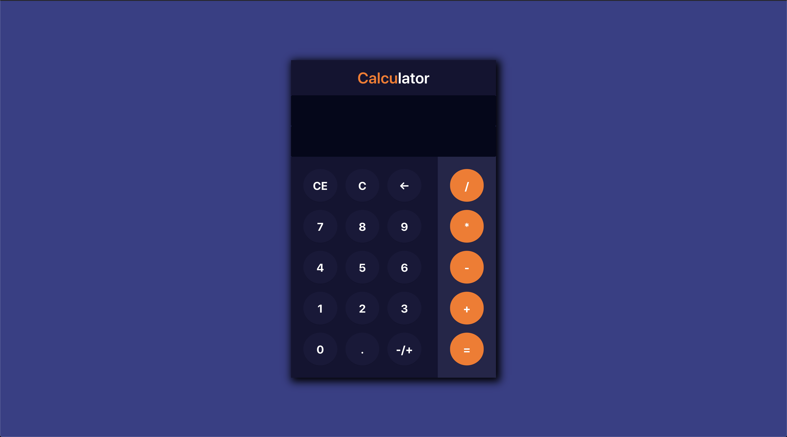

## An ordinary little calculator of basic math calculations such as plus(+), minus(-), multiplication(*) and division(/).

* This calculator was developed on the JavaScript programming language and React framework.

## *Enjoy the beautiful design.*

To learn React, check out the [React documentation](https://reactjs.org/).
